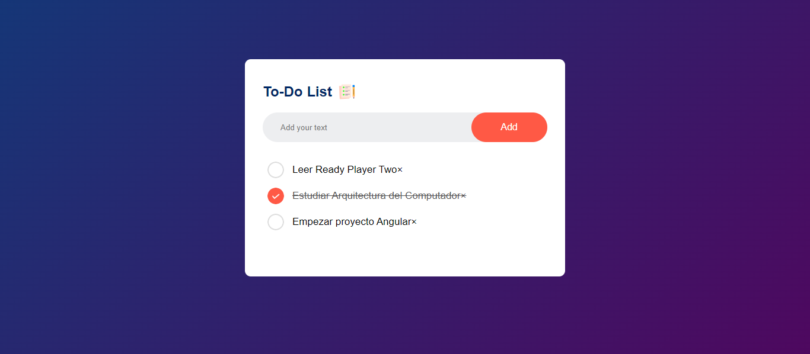

# To-Do List



Aplicación web simple que te permite organizar y gestionar tus tareas diarias de manera eficiente. Diseñada con una interfaz intuitiva y fácil de usar, esta aplicación te ayuda a mantenerte enfocado en lo que realmente importa al permitirte agregar, editar y eliminar tareas rápidamente. Perfecta tanto para uso personal como profesional.

## Descripción

La "To-Do List" es una herramienta de productividad diseñada para ayudarte a mantener un registro de tus tareas diarias. La aplicación te permite agregar, editar y eliminar tareas fácilmente. Con un diseño minimalista y funcional, está dirigida tanto a usuarios que buscan una forma sencilla de organizar sus quehaceres personales como a profesionales que necesitan gestionar sus pendientes laborales.

## Características

- **Agregar Tareas:** Permite a los usuarios añadir nuevas tareas a la lista.
- **Editar Tareas:** Los usuarios pueden modificar tareas existentes.
- **Eliminar Tareas:** Elimina tareas que ya no sean necesarias.
- **Interfaz Intuitiva:** Diseño simple y fácil de usar para una experiencia fluida.

## Tecnologías Utilizadas

- **HTML5:** Para la estructura básica de la aplicación.
- **CSS3:** Para el diseño y estilo de la interfaz de usuario.
- **JavaScript:** Para la lógica de la aplicación y la manipulación dinámica del DOM.

## Instalación

Para ejecutar esta aplicación en tu entorno local, sigue estos pasos:

1. **Clona el repositorio:**

   ```bash
   git clone https://github.com/lucas29951/to-do-list.git
2. **Navega al directorio del proyecto:**

   ```bash
   cd to-do-list
3. **Abre el archivo index.html en tu navegador:**
    Puedes hacerlo simplemente haciendo doble clic en el archivo index.html, o arrastrándolo a la ventana de tu navegador.

## Uso

1. **Agregar una Tarea:** Escribe la tarea en el campo de entrada y haz clic en "Agregar" o presiona Enter.
2. **Editar una Tarea:** Haz clic en el botón "Editar" junto a la tarea que deseas modificar, realiza los cambios y confirma.
3. **Eliminar una Tarea:** Haz clic en el botón "Eliminar" junto a la tarea que deseas quitar de la lista.

## Contribuciones

Las contribuciones son bienvenidas. Si deseas mejorar esta aplicación, por favor sigue estos pasos:

1. Haz un fork del proyecto.

2. Crea una nueva rama.
    ```bash
    (git checkout -b feature/nueva-funcionalidad).
3. Realiza tus cambios y haz un commit.
    ```bash
    (git commit -m 'Añadir nueva funcionalidad').
4. Haz push a la rama.

    ```bash
    (git push origin feature/nueva-funcionalidad).
5. Crea un Pull Request.

## Créditos

Este proyecto fue realizado en base al proyecto de [Avinash Kr](https://greatstack.dev/). Agradezco al autor por compartir sus conocimientos y recursos.

Puedes encontrar el video de como realizarlo en el siguiente enlace: [Enlace del video](https://youtu.be/G0jO8kUrg-I).


---

¡Gracias por visitar y contribuir!